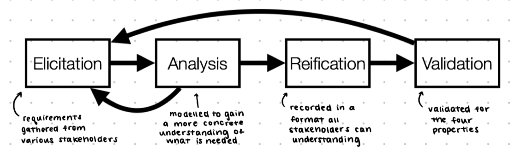

# Specifications

## Requirements

**Functional requirements:** what the system should do (specific features)  
**Non-functional requirements:** properties the system must have, often called quality attributes
- involve reliability, security, complexity, evolvability, performance, etc.
- low complexity, high performance, and good usability are often in conflict

Engage stakeholders to determine the most important things to them.
Specifications should be:
- **complete:** if not, it can create misunderstanding
- **consistent:** if not, it can make it hard to understand the right behaviour
- **precise:** if it isn't precise, it further complicates understanding the intended behaviour
- **concise:** too much can provide space for imprecision and inconsistency

Different types of requirements can be gathered:
- **design constraints:** ie. regulatory compliance, budget, languages and frameworks, development / security processes
- **environmental constraints:** ensure new system will work with existing systems
  - often mandate the **execution environment** (ie. OS, libraries, services) and **operational expectations** (ie. expected input, performance constraints, disaster recovery)

## Validating requirements

> *To measure is to know. If you cannot measure it, you cannot improve it.*

Endorsed by modern software companies: good decisions are always backed by **meaningful metrics**
- should be possible to validate that **all requirements have been met**, and that implementation is correct
- can be easy for some requirements (ie. "list should be sortable on both columns")
- some are difficult or impossible (ie. "the system should be performant")
  - can be restated and simplified
- good for technical team as it makes their **"definition of done"** extremely clear
  - if the objective is **unrealistic** it would be caught during requirement **elicitation**
- **concrete** - stakeholders will have consistent expectations about the final product
