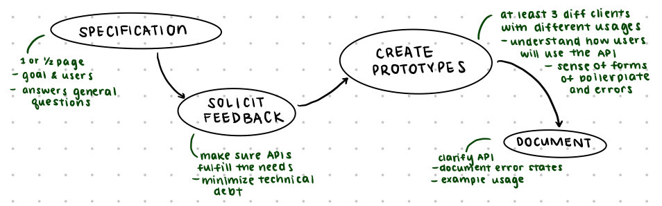

# APIs

## Introduction

**Application Programming Interfaces (APIs):** describe **programmatic interfaces** used for interacting with a software system
- can exist on many levels (ie. methods, classes, online services)
- main purpose: provide a predictable means of **programmatic interaction** and to **hide implementation details** from the API client
- allows the API owner to change their underlying implementation without affecting clients that may depend on it

Web-based services have propelled API design to the **forefront** of many organizations (typically through **REST** interfaces)
- services can be hosted behind APIs, so API owners can easily **maintain** and **update systems** and **control billing**
- once clients start to use they they are **difficult to change**, so it's importnat to carefully design interfaces to make them easy to understand, use, maintain, secure, and extend

## High Level API Design

#### Design goals:
- maximize **utility**
- minimize **technical debt**

#### High level API design advice:
*Running example:* we want to refactor the `getPaidUsersAndSortByName()` method in our API
- APIs should do do **one thing, and do it well**
  `getUsers(isPaid: boolean, sortIndex: number)`

- APIs should **never expose internal implementation details** - this makes it difficult for the consumer to use and for the maintainer to change
  `getUsers(isPaid: boolean, key: Users.KEY)`

- APIs should be kept **as small as possible**: once release, it is hard to remove
  `getUsers(isPaid: boolean)`

- **usability** of a system to another engineer is dictated by the quality of the API
  - **names** should be well-considered and consistent
  - constraints, APIs, and pre-/post-conditions should be **well-documented**
  - reduces developer surprise and helps them naturally move from one API to the next
  `getUsers(isPaid: boolean): User[]`

## Low Level API Design

#### Low level API design principles:
- avoid **long parameter lists**
  Ex. instead of `addUser(lastName, firstName, initial, username, email)`, we use `addUser(user: User)`

- return **descriptive objects** and avoid primitives
  Example:
  ```
  // return string "first, last, initial, user, email"
  getUserData(): string
  ```
  refactor to: `getUserData(): User`

- avoid **exceptional returns**
  Example:
  ```
  getUsers(): User[] | null;
  let u = getUsers();
  ```
  Clients will ALL have to **guard** since if it returns `null`, you'll get a `NullPointerException`. Refactor this to `getUsers(): User[]` and return `[]` instead of `null`.

- **handle** exceptional circumstances
  Example: `throw new MyInternalError({message: "internal error"});` exposes internal implementation of the error. Refactor this to `throw new Error({code: 215, message: "bad auth parameter", info: "http://dev.foo.com/215"})` with an info link on how to fix the exception

- favour **immutability** (object state should not be able to be modified): separation between API producer and consumer

- favour **private** classes, fields, and methods

## API Design Process



1. What is the goal of the API?
  - languages
  - protocols
  - platforms
  - formats
2. Who is the customer?
  - versioning
  - licensing
  - authentication

## Usability
Provide **effective affordances**, such as meaningful parameter types and data formats by thinking about how the APIs will be used in practice.

- think about **actions** and **error rates** for mapping and model
- think about **user satisfaction** for feedback

**visibility:** make it easier for a developer to understand what the API does and make it hard to misuse  
Ex. `items.sort("clearance")` can be misused if "clearance" is spelled incorrectly. Refactor to `items.sort(Filter.CLEARANCE)`.

**model:** abstractions that are easy to keep in mind  
Ex. `store.get(pid: string)`: "get" isn't very descriptive, so make it fit with the mental models. Refactor to `store.getProduct(pid: string)`. `store.getDept(did:string).getShelf(sid: string).getProduct(pid: string)` can also be refactored to the same method above; the developer doesn't care about the department and shelf.

**mapping:** between ideas of developer and affordances
Ex. `store.getProduct(pid: string): any` can be refactored to `store.getProduct(pid: string): Product` so the developer knows exactly what you're getting back

**feedback:** constant and early feedback when an API is used incorrectly
Ex. `items.sort("clearamce")` should check if the parameter is known, and throw an error with a *descriptive* message

## Platforms

API platforms are now an extremely popular way of **building business value**
- emerged in the early 2000s when companies realized they could focus their development efforts on building a **core set of functionality** that could be **extended by customers** or third party organizations
- think about **authentication, versioning, and how to migrate to new versions**
