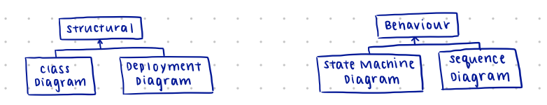

# Technical Representations

## Introduction

Many software systems fail because the wrong product is created.

- primary reason is because of **lack of precision within requirements**
- representations provide **concrete details** about aspects of system while omitting other parts
- decreases opacity of decision making and enables **concrete discussion**

## Diagrams
#### Should be:
- **concrete:** clarify hidden information
- **not ambiguous:** contain key details, not open to interpretation
- **accurate:** correct within a given tolerance
- **precise:** so the correct system can be built repeatedly from the same abstraction

Each can be considered a **view** of the system
- views have **specific goals**, focussing on a subset of elements or relationships
- typically concentrate on specific **concerns, scenarios, or stakeholders**
- views typically **overlap** - maintaining consistency between views is important, but can also identify problems in deployment (ie. can't get information between classes)

***structural diagrams:*** key elements and relationships within the system; includes **class diagrams** and **deployment diagrams**

***behavioural diagrams:*** how the system components interact at runtime; includes **state machine diagrams** and **sequence diagrams**

## Static vs dynamic
Need to think about execution of code: this matters to users! We need to think about the **static structure** as well as the **dynamic behaviour** at runtime

### Class diagrams (static)
Static representations of software **elements** and **relationships**.
- for object-oriented systems, they detail key **classes, fields, and methods** within a system and how they relate to each other statically
- typically focus on a key subset of elements (especially in fields and methods)
- can be translated fairly directly into code skeletons
- **rectangles:** classes and interfaces, with names, fields, and methods
  - method and field visibility clarified by prepending names with `+` (public), `#` (protected), or `-` (private)
- **edges:**
  - large **hollow arrows**: inheritance relationships
  - **dotted lines with simple arrowheads**: dependencies (typically through method calls and field references)
  - **solid lines with filled diamonds**: composition relationships; class at diamond-end creates and is primarily responsible for the lifecycle of one or more variables of the linked type

### Deployment diagrams (static)

Overlay static class diagrams onto the **execution containers** and **physical machines** upon which they will reside.

- particularly important for mobile, distributed, and cloud-based applications
- **key stakeholders:** developers, operations, dev/ops, QA, and infrastructure
- might only concentrate on mapping modules onto machines, but in more sophisticated environments could include mapping the software onto containers

### Sequence diagrams (dynamic)

Focus on how code elements **communicate** with each other capturing the **order of execution** of particular methods and the data passed between them.
- **stakeholders:** typically developers, also dev/ops, security, usability
- aims to model protocols and data flow through the system

### State machine diagrams

Models **event-based systems**, which accounts for most user interfaces, and considers "key" interactions

- details how the state machine is **entered/exited** and show possible transitions and capture cases where **transitions are forbidden** (ie. settled states)
